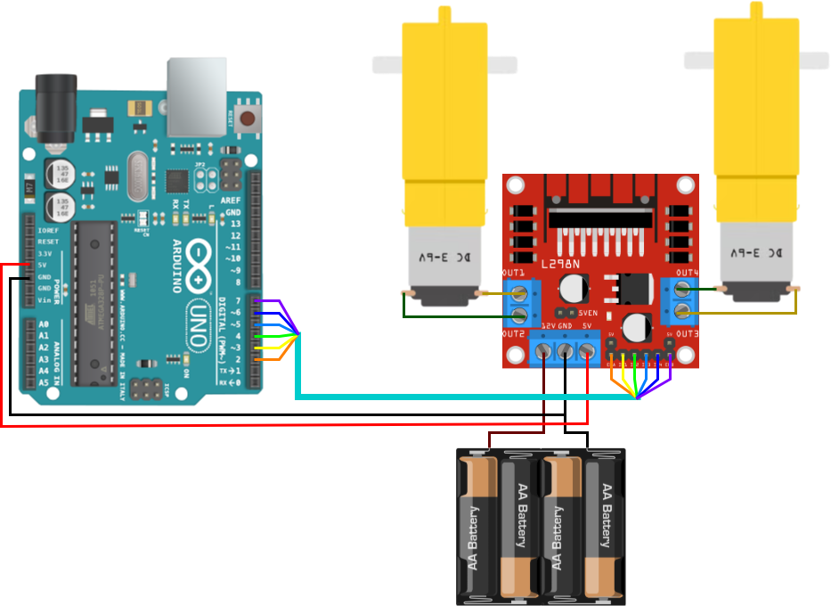
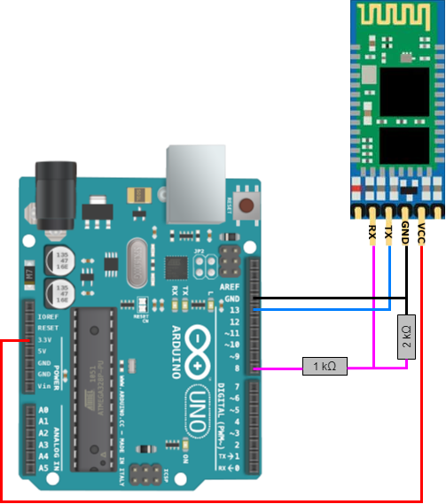
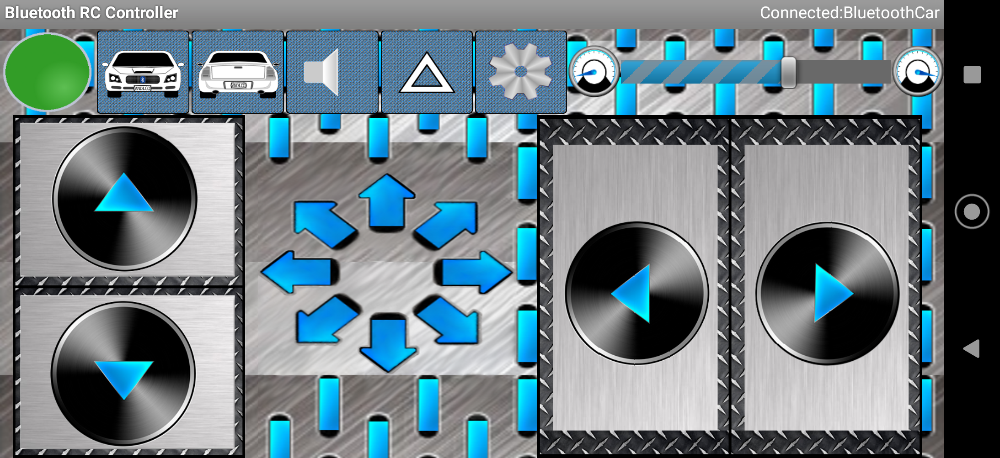

# BluetoothCar
University project of a car controlled by the mobile app via Bluetooth

## L298N Motor Driver

We are using L298N Motor Driver with 6V power supply from batteries.
This driver controls two TT motors.

## HC-06 Transceiver

We are using HC-06 Bluetooth Transceiver.

## App

We are using [Bluetooth RC Car mobile app](https://play.google.com/store/apps/details?id=braulio.calle.bluetoothRCcontroller&hl=pl&gl=US).

## Documentation

You can build documentation using [doxygen](https://www.doxygen.nl/) and provided `Doxyfile`
